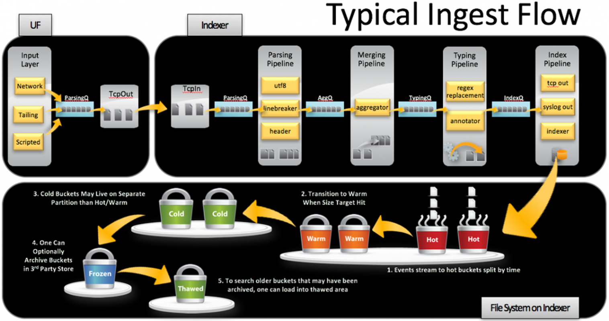

# Splunk Data Ingestion Pipeline 

The top section of the image represents the Typical Ingest Flow in Splunk. It shows how data is processed from ingestion to indexing. Let me break it down into its major stages:

## Input Layer (UF - Universal Forwarder)
This is where data enters the Splunk ecosystem. The Universal Forwarder collects data from various sources:
- **Network:** Data sent over TCP or UDP.
- **Tailing:** Reads logs from files (e.g., /var/log or application logs).
- **Scripted:** Data collected by running custom scripts.

The data passes through the **Parsing Queue (ParsingQ)** and is sent to the TcpOut component to forward it to the indexer.

## Indexer (Data Processing Pipelines)
The indexer handles the data's ingestion, processing, and storage. The pipelines shown in the image describe the sequential steps Splunk follows:

### Parsing Pipeline
- Splits the incoming raw data stream into individual events based on line breaks (linebreaker).
- Extracts metadata (e.g., host, source, sourcetype) using headers.

### Merging Pipeline
- Combines multiple small chunks of data into larger aggregated events to optimize processing (aggregator).

### Typing Pipeline
- Applies regex patterns to identify and modify data.
- Annotates events with additional information, such as timestamps, fields, and key-value pairs.

### Index Pipeline
- Finalizes the processed data and prepares it for indexing.
- Sends events to: The indexer, where data is stored.
- Outputs like tcp_out (forwarding) or syslog_out (logging).

### File System Buckets
This section transitions into the data storage model of Splunk on the indexer. It shows how processed data is stored in "buckets" with different life cycle stages:
- **Hot:** Actively written-to buckets for real-time data ingestion. ($SPLUNK_HOME/var/lib/splunk/defaultdb/db/*)
- **Warm:** Data moved from "hot" buckets after they are full. ($SPLUNK_HOME/var/lib/splunk/defaultdb/db/*)
- **Cold:** Older data that is no longer frequently accessed. ($SPLUNK_HOME/var/lib/splunk/defaultdb/colddb/*)
- **Frozen:** Data archived to third-party storage systems. its custom specify by the user
- **Thawed:** Archived data brought back for searching. ($SPLUNK_HOME/var/lib/splunk/defaultdb/thaweddb/*)

This process ensures that Splunk efficiently handles large-scale data ingestion while maintaining search and retrieval performance. Each stage optimizes the flow from raw data collection to searchable storage.
